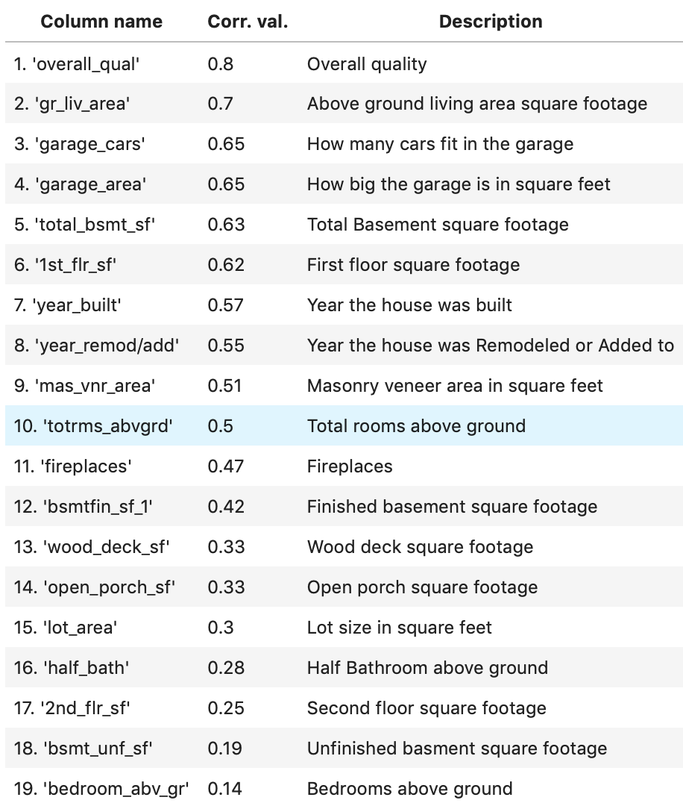
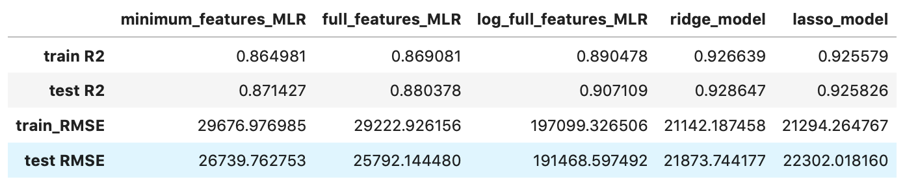

# Ames Housing Project README
*Author: Joshua Leibow (LA)*

This repo houses my workflow and organization for the Ames Housing project.

# Ames Housing Price Predictor

## Problem Statement

To create a template for an app that predicts sale prices for homes all over the country, I will build a model that predicts housing prices in Ames Iowa.

## Data Dicitonary
Here is a link to a [complete data dictionary](http://jse.amstat.org/v19n3/decock/DataDocumentation.txt) of the Ames housing dataset, provided by the Journal of Statistics Education.

In addition, I have created my own data dictionary based on the X variables I considered using for my model.  The variables are listed in descending order according to their correlation to saleprice values.

#### 

## Contents

1. 01_Cleaning - Here I import the data, drop non-numeric columns, deal with missing values and create dummy columns for non-numeric categories.

2. 02_EDA - Here I explore the data through the usage of plots and visualizations.  From the visualizations, I made inferences that helped me to determine which variables would be good for predictive modeling.  There were some variables that were not neccessarily good for my model, yet, helped me, nonetheless, to understand the diversity of qualities that bring value to a home.

3. 03A_MLR_Model - In this notebook I create my features matrix (X) and my target vector (y).  Afterwards, I create the train test split function to use to instantiate and fit my model with Linear Regression.  I evaluate my model using train score and K-fold cross validation to obtain the train /test R2 and RMSE scores.  I then plot the predicted values of y_hat vs. the actual values of y to get a visual representation of how well fit my model is.  There are 3 different versions of Multi Linear Regression (MLR) in this notebook in descending order.  The first version contains all of the variables I chose for my model (full features), the second version has a few features taken away (minimal features), and the third is a version in which y is transformed into log_y and has has all the same features as the first version.

4.  03B_Ridge_Model - In this notebook I scale my MLR data and use it to instantiate and fit to the Ridge Model.  The Ridge Model is a type of regularization that determines and subtracts the variables that contribute to the overfitting of my model.  With the Ridge model, I obtain a signicantly higher R2 score from the log model, which was my best model that I fit manually.

5.  03C_Lasso_Model - Similar to the Ridge Model, but unique in its own way, I again subject my MLR model to a process of scaling and regularization, this time to the Lasso Model.  I obtain a similar score similar to the Ridge Model by computationally cutting down on the variables that are not ideal for my model.

3. Kaggle Submission - Here I take my best linear regression model, in this case the log model, and submit it to Kaggle to predict prices for new test data that has been provided as part of a Kaggle competition.

## Findings

# 

From the table we can see that the log, ridge and lasso models gave the best scores. The lasso and ridge models have the highest R2 scores and lowest RMSE scores, with deference to the Ridge model.

The Ridge model's test R2 is .9286, which we interpret to mean that 92.86% of the variability in our data is explained by our model, relative to a model with no predictors.

Ther Ridge model's test RMSE score is 21873.74, which means that the model predicts an approximate level of accuracy that is  + or - \$21,873 of the true sale price value.

I believe that my model can be used to infer coefficient variables such as square footage, overall quality, number of bedrooms, number of bathrooms and garage car size.

I believe my model will generalize well to new data, because the train and test R2 scores are within a close range of 0.002.  The implication is that my model is well fit.

## Slides
Presentation slides are [available here.](./presentation_slides/SEMA.pdf)